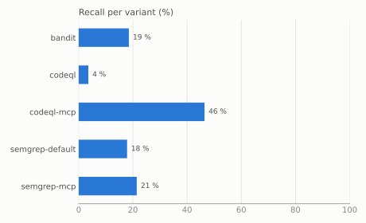

# mcp-vulnbench

An open benchmark of real, publicly disclosed vulnerabilities in open-source
[MCP](https://modelcontextprotocol.io) servers, and a harness that runs static analyzers on every
case in Docker and scores them.

Each case pins the vulnerable and the fixed commit, the CWE and the exact code location, so a tool
is measured on finding the bug *and* on recognizing the fix.

> Status: v0.2.0 – milestone 2a (28 Python cases; Semgrep, CodeQL, Bandit, and CodeQL with the
> MCP models of this repository). Next: TypeScript cases.

## Results (v0.2.0)

28 publicly disclosed vulnerabilities in 23 open-source Python MCP server projects (13 path
traversal, 5 command injection, 5 SSRF, 3 SQL injection, 2 code injection), five analyzer variants
without any tuning (the [methodology](docs/methodology.md#tool-configuration) lists the few
deliberate settings). `codeql-mcp` is CodeQL plus the
[MCP source models](models/codeql/mcp/models) of this repository, run on Python only; nothing else
differs.

| Variant | Cases (ok) | Detected | Recall | Fix recognized | Alarms/KLOC | Error rate |
|---|---:|---:|---:|---:|---:|---:|
| bandit | 27 | 5 | 19 % | 20 % (1/5) | 1.44 | 4 % |
| codeql | 28 | 1 | 4 % | 100 % (1/1) | 0.17 | 0 % |
| codeql-mcp | 28 | 13 | 46 % | 15 % (2/13) | 0.82 | 0 % |
| semgrep-default | 28 | 5 | 18 % | 20 % (1/5) | 1.22 | 0 % |
| semgrep-mcp | 28 | 6 | 21 % | 17 % (1/6) | 1.22 | 0 % |



The models were written on a development half of the cases and frozen (tag `models-v1`) before
the other half was measured; the [methodology](docs/methodology.md#development-and-test-split)
explains the split. The test half is the fair comparison:

| Variant | Half | Cases (ok) | Detected | Recall | Fix recognized | Alarms/KLOC |
|---|---|---:|---:|---:|---:|---:|
| codeql | dev | 12 | 1 | 8 % | 100 % (1/1) | 0.07 |
| codeql-mcp | dev | 12 | 4 | 33 % | 25 % (1/4) | 0.54 |
| codeql | test | 16 | 0 | 0 % | – | 0.27 |
| codeql-mcp | test | 16 | 9 | 56 % | 11 % (1/9) | 1.09 |

- On the test half, the models take CodeQL from 0 of 16 cases to 9 of 16: 5 of 7 path traversals,
  2 of 3 command injections, 1 of 3 SSRF cases and the SQL injection, but neither code injection.
  In the spot checks (mcpvb-0002, 0009, 0025) the finding is on the sink line: the `shell=True`
  call, the `client.get(url)` with the tool's path appended, the f-string query. Nothing that
  `codeql` found is lost.
- The cost is four times as many alarms per KLOC (0.27 to 1.09 on the test half). Over all 28
  cases that is still fewer than Bandit or Semgrep report (0.82 against 1.44 and 1.22), on the test
  half more (1.09 against 0.65 and 0.49); the median test-half server gets 4.5 alarms instead of
  none. Of the 383 additional findings on the vulnerable versions, 199 are `py/path-injection`,
  concentrated in three servers that hand file paths around (mcpvb-0020, 0027, 0018 with 51, 47
  and 45), and 144 are `py/log-injection`, which the benchmark counts separately because log
  injection is not one of its five classes.
- What still escapes `codeql-mcp` on the test half is mostly sinks CodeQL does not model: the git
  server of the official `servers` repository runs GitPython (`repo.git.diff`, `Repo.init`,
  `index.add`), the Stata server feeds Stata through a `pexpect` child, the scrapling server
  fetches through `scrapling`. In fastmcp's own OpenAPI tools the taint reaches `OpenAPITool.run`
  and dies at the request director; the `httpx.Request` it builds is not a modeled sink either.
- The development half shows the limits of the model form itself. Tools registered through
  registries, dicts or dataclass fields never become sources, and neither do tools behind a
  project decorator (auth or error handling), because CodeQL does not follow the handler through
  `functools.wraps` or `func(*args, **kwargs)`. Where the source is placed, taint still dies in
  connection managers, `request.state` and config objects whose types CodeQL cannot infer.
- `codeql-mcp` recognizes the fix in 2 of its 13 detections. In the cases checked (mcpvb-0005,
  0020, 0023) the fix validates with a project helper (a path-containment check, a hostname
  comparison after `urlparse`) that CodeQL does not treat as a barrier, so the alert stays on the
  same sink in the fixed version.
- Three stable CodeQL queries (`py/xxe`, `py/xml-bomb`, `py/nosql-injection`) take only
  `RemoteFlowSource` and never see sources defined as data extensions; a small reproducer is part
  of the upstream report, [github/codeql#22702](https://github.com/github/codeql/issues/22702),
  which also proposes the models.

Limitations: 28 cases is a small sample, and the test half has 16, so one case moves a variant's
recall there by about six percentage points; code injection is represented by two cases from one
repository, and two of the three SQL-injection cases (mcpvb-0011, mcpvb-0012) share a commit pair
and their sink function, so one finding there counts for both. Only Python servers and only static
analyzers are measured; MCP scanners that inspect the tool descriptions of running servers look for
a different class of problems and are not part of the benchmark. There is no precision column; the
[methodology](docs/methodology.md#why-there-is-no-precision) explains why and which figures
approximate false alarms instead. In two cases the fixed version still contains a related weakness
(mcpvb-0006: a second path traversal that was fixed later; mcpvb-0022: private hosts stay reachable
by design), so a persisting finding there is not necessarily a missed fix. Bandit's two runs on
fastmcp end in an error because its SARIF formatter crashes on that repository
([PyCQA/bandit#1311](https://github.com/PyCQA/bandit/issues/1311)).

Full report with the per-case table: [docs/results-v0.2.0.md](docs/results-v0.2.0.md). The
v0.1.0 results (26 cases, four variants) are kept in [docs/results-v0.1.0.md](docs/results-v0.1.0.md).

## Quick start

Requires [uv](https://docs.astral.sh/uv/) and a running Docker daemon.

```bash
uv sync
uv run mcpvb images          # builds the analyzer images locally (never pushed)
uv run mcpvb bench           # fetch -> run -> score -> report
# the report is written to results/latest/report.md
```

## Documentation

- [Design](docs/design.md)
- [Methodology](docs/methodology.md) – metric definitions
- [Adding a case](docs/curation.md)
- [MCP models for CodeQL](models/codeql/mcp/models)

## License

Code: MIT. Case annotations in `cases/`: CC BY 4.0 (see `LICENSE-DATA`). The analyzed projects keep
their own licenses; their code is not part of this repository.
