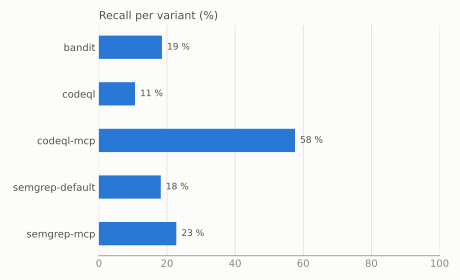

# mcp-vulnbench

An open benchmark of real, publicly disclosed vulnerabilities in open-source
[MCP](https://modelcontextprotocol.io) servers, and a harness that runs static analyzers on every
case in Docker and scores them.

Each case pins the vulnerable and the fixed commit, the CWE and the exact code location, so a tool
is measured on finding the bug *and* on recognizing the fix.

> Status: v0.5.0 – milestone 2b (66 cases in Python, TypeScript and JavaScript; Semgrep, CodeQL,
> Bandit, and CodeQL with the MCP models of this repository). Next: v1.0.

## Results (v0.5.0)

66 publicly disclosed vulnerabilities in 55 open-source MCP server projects, 28 in Python and 38
in TypeScript or JavaScript (24 command injection, 20 path traversal, 17 SSRF, 3 SQL injection,
2 code injection), five analyzer variants without any tuning (the
[methodology](docs/methodology.md#tool-configuration) lists the few deliberate settings).
`codeql-mcp` is CodeQL plus the [MCP models](models/codeql) of this repository; nothing else
differs. Bandit analyzes Python only.

| Variant | Cases (ok) | Detected | Recall | Fix recognized | Alarms/KLOC | Error rate |
|---|---:|---:|---:|---:|---:|---:|
| bandit | 27 | 5 | 19 % | 20 % (1/5) | 1.44 | 4 % |
| codeql | 66 | 7 | 11 % | 86 % (6/7) | 0.16 | 0 % |
| codeql-mcp | 66 | 38 | 58 % | 50 % (19/38) | 1.32 | 0 % |
| semgrep-default | 66 | 12 | 18 % | 33 % (4/12) | 2.40 | 0 % |
| semgrep-mcp | 66 | 15 | 23 % | 27 % (4/15) | 3.67 | 0 % |



The models are written on a development half of the cases and frozen before the other half is
measured: tag `models-v1` for Python, `models-v2` for TypeScript and JavaScript (the
[methodology](docs/methodology.md#development-and-test-split) explains the split). The test
halves are the fair comparison; on both together `codeql` finds 3 of 37 cases and `codeql-mcp` 23.

| Variant | Language | Half | Cases (ok) | Detected | Recall | Fix recognized | Alarms/KLOC |
|---|---|---|---:|---:|---:|---:|---:|
| codeql | Python | dev | 12 | 1 | 8 % | 100 % (1/1) | 0.07 |
| codeql-mcp | Python | dev | 12 | 4 | 33 % | 25 % (1/4) | 0.54 |
| codeql | Python | test | 16 | 0 | 0 % | – | 0.27 |
| codeql-mcp | Python | test | 16 | 9 | 56 % | 11 % (1/9) | 1.09 |
| codeql | JavaScript/TypeScript | dev | 17 | 3 | 18 % | 67 % (2/3) | 0.20 |
| codeql-mcp | JavaScript/TypeScript | dev | 17 | 11 | 65 % | 55 % (6/11) | 1.23 |
| codeql | JavaScript/TypeScript | test | 21 | 3 | 14 % | 100 % (3/3) | 0.08 |
| codeql-mcp | JavaScript/TypeScript | test | 21 | 14 | 67 % | 79 % (11/14) | 2.62 |

### TypeScript and JavaScript (new in v0.5.0)

- On the test half the models take CodeQL from 3 of 21 cases to 14: all 11 command injections,
  1 of 4 path traversals and 2 of 6 SSRF cases. In the spot checks (mcpvb-0029, 0034, 0060, 0064)
  the finding is on the sink line of the case file: the `exec` of the ssh command string, the
  `exec` of `df -h "${targetPath}"`, Puppeteer's `page.goto(args.url)`, the `fetch(url)`. Nothing
  that `codeql` found is lost.
- Plain CodeQL is less blind here than for Python. It finds 6 of the 38 cases, but none through
  the tool argument: in four an environment variable flows into the same `exec` call
  (`js/indirect-command-line-injection`), in one the vulnerable method is exported and counts as
  library input, and one project has an Express API next to MCP that reaches the same function.
- The schema library decides whether a low-level handler is seen. The first version of the
  models found 9 of the 17 development cases. In two more the input was lost at
  `Schema.parse(args)`, because CodeQL has no model of zod, the library the SDK's schemas are
  written in. Four rows that carry taint through `parse` and `safeParse` bring the development
  half to 11 of 17; they were frozen with the rest.
- These rows have a gap that only the test half showed. `js/path-injection` is a data-flow query
  with its own flow states and does not follow a summary of kind `taint`, so a path that went
  through `parse` is still lost (mcpvb-0054). A probe confirms that the same rows with kind
  `value` would be followed. The models stay as they were measured.
- The cost on the test half: 12 alarms become 388 (0.08 to 2.62 per KLOC, median 2 per server).
  Both Semgrep variants report more on the same code (434 and 713). 255 of the 388 are
  `js/path-injection` in two servers whose tools read and write caller-chosen paths by design
  (mcpvb-0053, 0034), and 45 are `js/command-line-injection` in git-mcp-server, where the fix of
  mcpvb-0033 replaced `exec` in 23 files.
- What else escapes `codeql-mcp` has the same two reasons as in Python. Sinks CodeQL does not
  model: `fetch` from `undici`, Playwright's `page.goto` and `request.get` (Puppeteer's
  `page.goto` is known, see mcpvb-0060), the client of a third-party SDK. And flows lost in
  project code: a server object kept in a field of a wrapper class, a handler table merged from
  several modules, a service injected through a factory, a project's own `tool()` helper around
  `registerTool`.
- Fixes are recognized more often than in Python: in 17 of 25 detections against 2 of 13. Most
  command-injection fixes replace `exec` with `execFile` and an argument list, which removes the
  sink. Where a fix validates with a helper of the project, the alert stays.
- Semgrep's default rules find 7 of the 38 cases: command injections through
  `detect-child-process`, path traversals through audit rules that flag every non-literal file
  name. The MCP rules add two SSRF cases that no other variant finds (mcpvb-0061, 0062, both
  Playwright requests), at the price of 904 `mcp-ssrf-typescript` findings on the 38 servers.

### Python (unchanged since v0.2.0)

Every Python run was repeated with the images of v0.5.0; all 140 case outcomes equal those of
v0.2.0.

- On the test half, the models take CodeQL from 0 of 16 cases to 9 of 16: 5 of 7 path traversals,
  2 of 3 command injections, 1 of 3 SSRF cases and the SQL injection, but neither code injection.
  In the spot checks (mcpvb-0002, 0009, 0025) the finding is on the sink line: the `shell=True`
  call, the `client.get(url)` with the tool's path appended, the f-string query. Nothing that
  `codeql` found is lost.
- The cost is four times as many alarms per KLOC (0.27 to 1.09 on the test half). Over all 28
  cases that is still fewer than Bandit or Semgrep report (0.82 against 1.44 and 1.22), on the test
  half more (1.09 against 0.65 and 0.49); the median test-half server gets 4.5 alarms instead of
  none. Of the 383 additional findings on the vulnerable versions, 199 are `py/path-injection`,
  concentrated in three servers that hand file paths around (mcpvb-0020, 0027, 0018 with 51, 47
  and 45), and 144 are `py/log-injection`, which the benchmark counts separately because log
  injection is not one of its five classes.
- What still escapes `codeql-mcp` on the test half is mostly sinks CodeQL does not model: the git
  server of the official `servers` repository runs GitPython (`repo.git.diff`, `Repo.init`,
  `index.add`), the Stata server feeds Stata through a `pexpect` child, the scrapling server
  fetches through `scrapling`. In fastmcp's own OpenAPI tools the taint reaches `OpenAPITool.run`
  and dies at the request director; the `httpx.Request` it builds is not a modeled sink either.
- The development half shows the limits of the model form itself. Tools registered through
  registries, dicts or dataclass fields never become sources, and neither do tools behind a
  project decorator (auth or error handling), because CodeQL does not follow the handler through
  `functools.wraps` or `func(*args, **kwargs)`. Where the source is placed, taint still dies in
  connection managers, `request.state` and config objects whose types CodeQL cannot infer.
- `codeql-mcp` recognizes the fix in 2 of its 13 detections. In the cases checked (mcpvb-0005,
  0020, 0023) the fix validates with a project helper (a path-containment check, a hostname
  comparison after `urlparse`) that CodeQL does not treat as a barrier, so the alert stays on the
  same sink in the fixed version.
- Three stable CodeQL queries (`py/xxe`, `py/xml-bomb`, `py/nosql-injection`) take only
  `RemoteFlowSource` and never see sources defined as data extensions; a small reproducer is part
  of the upstream report, [github/codeql#22702](https://github.com/github/codeql/issues/22702),
  which also proposes the models.

### Limitations

- 66 cases is still a small sample. A test half has 16 or 21 cases, so one case moves a variant's
  recall there by five to six percentage points.
- The TypeScript and JavaScript cases cover three of the five classes (the reviewed advisories
  had no clean SQL-injection or code-injection case), and only three of them are JavaScript, all
  in the test half. Code injection is represented by two Python cases from one repository, and
  two of the three SQL-injection cases (mcpvb-0011, mcpvb-0012) share a commit pair and their sink
  function, so one finding there counts for both.
- Detection is decided per function: a finding of the case's class inside a ground-truth function
  counts, also when it reports another flow into the same sink, as the six TypeScript detections
  of plain CodeQL do.
- In 14 cases the fixed version is not clean: it keeps a weakness of the same class that was
  fixed later or is intended, or the location is too coarse to tell tools apart. The report marks
  them and gives fix recognition also without them (`codeql-mcp`: 14 of 29 instead of 19 of 38).
- Only static analyzers are measured. MCP scanners that inspect the tool descriptions of running
  servers look for a different class of problems and are not part of the benchmark.
- There is no precision column; the [methodology](docs/methodology.md#why-there-is-no-precision)
  explains why and which figures approximate false alarms instead.
- Bandit's two runs on fastmcp end in an error because its SARIF formatter crashes on that
  repository ([PyCQA/bandit#1311](https://github.com/PyCQA/bandit/issues/1311)).

Full report with the per-case table: [docs/results-v0.5.0.md](docs/results-v0.5.0.md). Earlier
results: [v0.2.0](docs/results-v0.2.0.md) (28 Python cases) and
[v0.1.0](docs/results-v0.1.0.md) (26 cases, four variants).

## Quick start

Requires [uv](https://docs.astral.sh/uv/) and a running Docker daemon.

```bash
uv sync
uv run mcpvb images          # builds the analyzer images locally (never pushed)
uv run mcpvb bench           # fetch -> run -> score -> report
# the report is written to results/latest/report.md
```

## Documentation

- [Design](docs/design.md)
- [Methodology](docs/methodology.md) – metric definitions
- [Adding a case](docs/curation.md)
- [MCP models for CodeQL](models/codeql): one pack for Python, one for JavaScript and TypeScript

## License

Code: MIT. Case annotations in `cases/`: CC BY 4.0 (see `LICENSE-DATA`). The analyzed projects keep
their own licenses; their code is not part of this repository.
