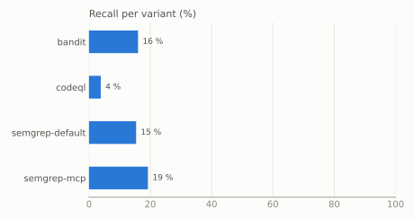

# mcp-vulnbench results (v0.1.0)

Tools: bandit (bandit 1.9.4), codeql (codeql 2.27.1), semgrep-default (semgrep 1.178.0), semgrep-mcp (semgrep 1.178.0)

Cases: 26

## Overview

| Variant | Cases (ok) | Detected | Recall | Fix recognized | Alarms/KLOC | Error rate |
|---|---:|---:|---:|---:|---:|---:|
| bandit | 25 | 4 | 16 % | 0 % | 1.44 | 4 % |
| codeql | 26 | 1 | 4 % | 100 % | 0.18 | 0 % |
| semgrep-default | 26 | 4 | 15 % | 0 % | 1.19 | 0 % |
| semgrep-mcp | 26 | 5 | 19 % | 0 % | 1.19 | 0 % |

## Recall by class

| Variant | command-injection | path-traversal | ssrf | sql-injection | code-injection |
|---|---:|---:|---:|---:|---:|
| bandit | 75 % (3/4) | 0 % (0/12) | 0 % (0/4) | 33 % (1/3) | 0 % (0/2) |
| codeql | 25 % (1/4) | 0 % (0/12) | 0 % (0/5) | 0 % (0/3) | 0 % (0/2) |
| semgrep-default | 75 % (3/4) | 0 % (0/12) | 0 % (0/5) | 33 % (1/3) | 0 % (0/2) |
| semgrep-mcp | 75 % (3/4) | 0 % (0/12) | 20 % (1/5) | 33 % (1/3) | 0 % (0/2) |

## Run status

| Variant | ok | error | timeout | unsupported | unavailable |
|---|---:|---:|---:|---:|---:|
| bandit | 50 | 2 | 0 | 0 | 0 |
| codeql | 52 | 0 | 0 | 0 | 0 |
| semgrep-default | 52 | 0 | 0 | 0 | 0 |
| semgrep-mcp | 52 | 0 | 0 | 0 | 0 |

## Details

| Variant | Recall (file level) | Recall (any class) | Recall (python) | Median alarms/case | Unclassified findings |
|---|---:|---:|---:|---:|---:|
| bandit | 24 % | 20 % | 16 % | 2 | 597 |
| codeql | 4 % | 4 % | 4 % | 0 | 87 |
| semgrep-default | 15 % | 19 % | 15 % | 1.5 | 136 |
| semgrep-mcp | 19 % | 23 % | 19 % | 1.5 | 137 |

## Cases

✓ detected, fix recognized · ◐ detected, fix not recognized · ● detected, fixed version not assessed · ✗ missed · err / t/o / n/s / n/a: run of the vulnerable version failed, timed out, is unsupported or had no sources

| Case | Class | bandit | codeql | semgrep-default | semgrep-mcp |
|---|---|---|---|---|---|
| mcpvb-0001 | command-injection | ◐ | ✗ | ◐ | ◐ |
| mcpvb-0002 | command-injection | ◐ | ✗ | ◐ | ◐ |
| mcpvb-0003 | command-injection | ✗ | ✗ | ✗ | ✗ |
| mcpvb-0004 | path-traversal | ✗ | ✗ | ✗ | ✗ |
| mcpvb-0005 | path-traversal | ✗ | ✗ | ✗ | ✗ |
| mcpvb-0006 | path-traversal | ✗ | ✗ | ✗ | ✗ |
| mcpvb-0007 | path-traversal | ✗ | ✗ | ✗ | ✗ |
| mcpvb-0008 | path-traversal | ✗ | ✗ | ✗ | ✗ |
| mcpvb-0009 | ssrf | ✗ | ✗ | ✗ | ✗ |
| mcpvb-0010 | ssrf | ✗ | ✗ | ✗ | ✗ |
| mcpvb-0011 | sql-injection | ✗ | ✗ | ✗ | ✗ |
| mcpvb-0012 | sql-injection | ✗ | ✗ | ✗ | ✗ |
| mcpvb-0013 | code-injection | ✗ | ✗ | ✗ | ✗ |
| mcpvb-0014 | command-injection | ◐ | ✓ | ◐ | ◐ |
| mcpvb-0015 | path-traversal | ✗ | ✗ | ✗ | ✗ |
| mcpvb-0016 | path-traversal | ✗ | ✗ | ✗ | ✗ |
| mcpvb-0017 | path-traversal | ✗ | ✗ | ✗ | ✗ |
| mcpvb-0018 | path-traversal | ✗ | ✗ | ✗ | ✗ |
| mcpvb-0019 | path-traversal | ✗ | ✗ | ✗ | ✗ |
| mcpvb-0020 | path-traversal | ✗ | ✗ | ✗ | ✗ |
| mcpvb-0021 | path-traversal | ✗ | ✗ | ✗ | ✗ |
| mcpvb-0022 | ssrf | ✗ | ✗ | ✗ | ✗ |
| mcpvb-0023 | ssrf | ✗ | ✗ | ✗ | ◐ |
| mcpvb-0024 | ssrf | err | ✗ | ✗ | ✗ |
| mcpvb-0025 | sql-injection | ◐ | ✗ | ◐ | ◐ |
| mcpvb-0026 | code-injection | ✗ | ✗ | ✗ | ✗ |

Metric definitions: [methodology.md](methodology.md)
